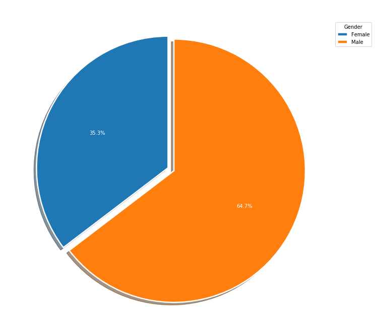
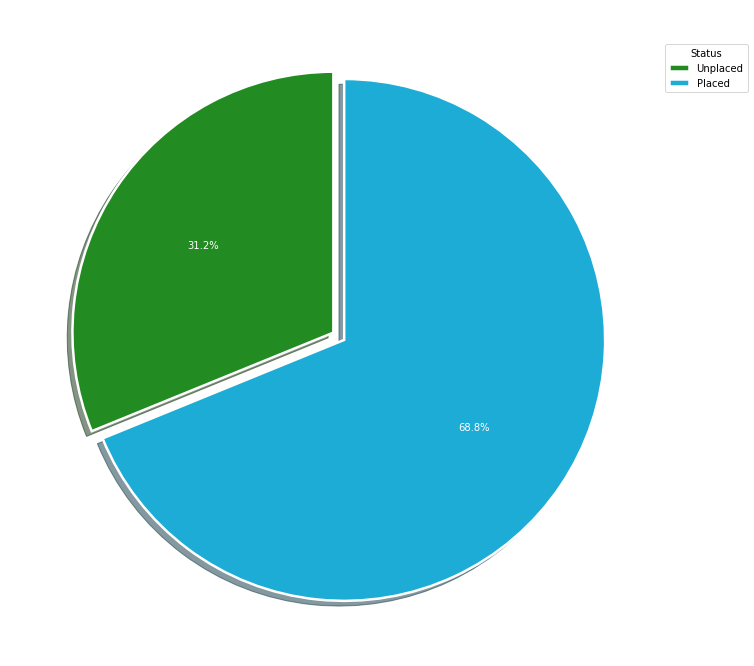
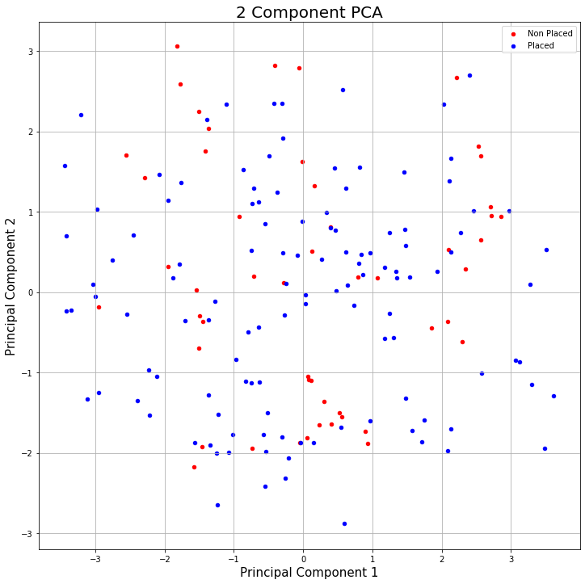

# Placement with PCA and LDA

## Problem Statement

The main purpose of the project is to make ***size-reduce*** to the independent variable in the dataset via ***LDA*** and ***PCA***. Then, the dependent variable is to estimate the ***status*** with the logistic regression method.

## Dataset

Dataset is downloaded from [Kaggle](https://www.kaggle.com/benroshan/factors-affecting-campus-placement) website. Dataset has **15 columns** and **215 rows without the header**.

## Methodology

results were obtained through classifiaction method which is ***Logistic Regression***.  You are free to visit [Machine Learning: Classification Models](https://medium.com/fuzz/machine-learning-classification-models-3040f71e2529) website for learn the methods better.

For reducing dimensions, **Principal Component Analysis (PDA) and Linear Discriminant Analysis (LDA)** was used that 13 dimensional data into 1 and 2 dimensions. 

## Analysis

| # | Column | Non-Null Count | Dtype |
|--|--|--|--|
| 0 | 0 | 215 non-null | int64
| 1 | 1 | 215 non-null | object
| 2 | 2 | 215 non-null | float64
| 3 | 3 | 215 non-null | object
| 4 | 4 | 215 non-null | float64
| 5 | 5 | 215 non-null | object
| 6 | 6 | 215 non-null | object
| 7 | 7 | 215 non-null | float64
| 8 | 8 | 215 non-null | object
| 9 | 9 | 215 non-null | object
| 10 | 10 | 215 non-null | float64
| 11 | 11 | 215 non-null | object
| 12 | 12 | 215 non-null | float64
| 13 | 13 | 215 non-null | object
| 14 | 14 | 215 non-null | float64

dtypes: **float64(6), int64(1), object(8)**
memory usage: 25.3+ KB

**Process took 2.479722261428833 seconds.**

> ***0*** duplicated data in dataset.

The gender distribution within the dataset is indicated in the pie chart below:

The status distribution within the dataset is indicated in the pie chart below:

### Principal Component Analysis (PCA) and Linear Discriminant Analysis (LDA) with Logistic Regression

### Principal Component Analysis (PCA)

The original data has 15 columns except independent variable column (y). In this section, the code projects the original data which is 13 dimensional into 2 dimensions. I should note that after dimensionality reduction, there usually isn’t a particular meaning assigned to each principal component. The new components have got two main dimensions of variation instead of 13.

**Plot of Two Components:**

### **Confusion Matrices and Accuracy Scores**

***Actual / Without PCA Confusion Matrix :***

| 15 | 1 |
|--|--|
| **0** | **27** | 

> **Accuracy score: 0.9767441860465116**

***Actual / With PCA Confusion Matrix :***

| 11 | 5 |
|--|--|
| **2** | **25** |  

> **Accuracy score: 0.8372093023255814**

***Without PCA and with PCA Confusion Matrix :***
| 10 | 5 |
|--|--|
| **3** | **25** | 

> **Accuracy score: 0.813953488372093**

### Linear Discriminant Analysis (LDA)

***LDA and Actual Confusion Matrix :***

| 15 | 0 |
|--|--|
| **1** | **27** |

> **Accuracy score: 0.9767441860465116**

---

### K-Fold Cross Validation

**Success Mean:**
 1.0
 
**Success Standard Deviation:**
0.0

---

### Grid Search

**Best result:**
 0.9942857142857143
 
**Best parameters for Logistic Regression:**
{'C': 2, 'multi_class': 'auto', 'tol': 1}
 
## How to Run Code

Before running the code make sure that you have these libraries:

 - pandas 
 - matplotlib
 - warnings
 - sklearn
 - time
    
## Contact Me

If you have something to say to me please contact me: 

 - Twitter: [Doguilmak](https://twitter.com/Doguilmak) 
 - Mail address: doguilmak@gmail.com
 